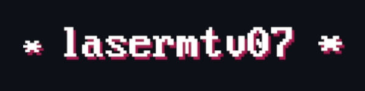

<!-- language-all: lang-html -->

 
 
 
 

# Hi,
my name is **lasermtv07** aka Michal Chmelar. I am 17 years old Czech highschool student, studying IT focused vocational school.
I am an avid Linux users, currently dualbooting Mint and Void Linux, however I am a distro hopper so that changes. I like to write FOSS code.
I am also into esoteric programming languages - a programming languages that weren't designed to be useful, but to be interesting and creative.
I'm sometimes learning statistics and automata theory, and recently I've started to get interested in low level programming, learning C and assembly.

I also exist.
## Books
> Note: This is in no way supposed to promote any eshop or service

\> [The way of Shamman](https://www.fictiondb.com/series/way-of-the-shaman-vasily-mahanenko~44512.htm) - V. Mahanenko 
\> [Play To Live](https://www.fictiondb.com/series/play-to-live-d-rus~45651.htm) - D. Rus 
\> [Snow Crash](https://en.wikipedia.org/wiki/Snow_Crash) - N. Stephenson 
\> [The Elenium](https://en.wikipedia.org/wiki/The_Elenium) - D. Eddins 
\> [Fractal Noise](https://en.wikipedia.org/wiki/Fractal_Noise) - C. Paolini 

## Links
\> [duanin2](https://github.com/duanin2) - my friend 
\> [sdomi.pl](https://sdomi.pl/) - interesting programming blog 
\> [Eric Murphy](https://ericmurphy.xyz/) - interesting youtuber

## Contact
\> e-mail: lasermtv07@volny.cz

---
(c) lasermtv07, 2024 - under CC-BY-SA 4.0
